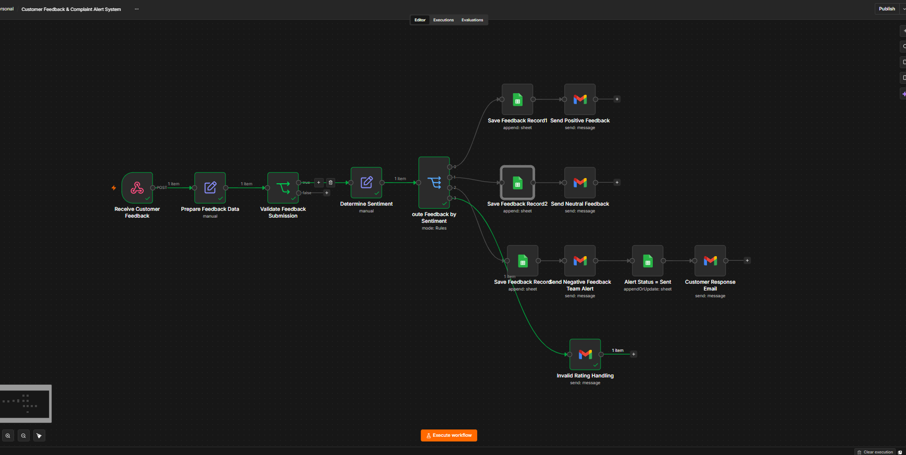
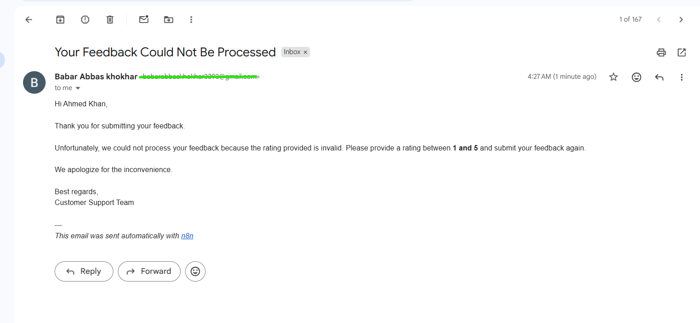
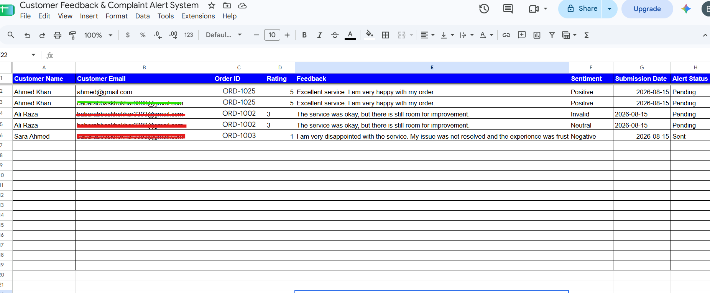
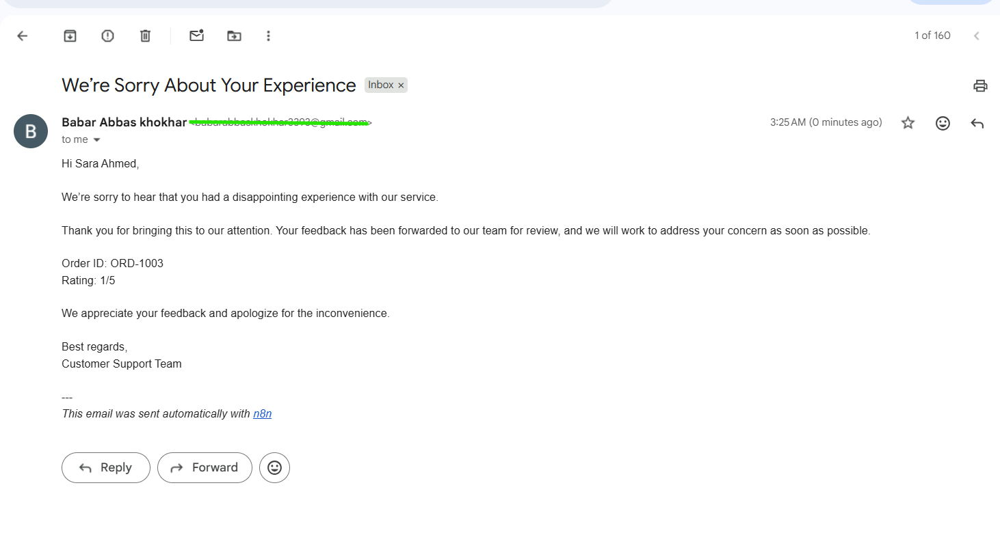
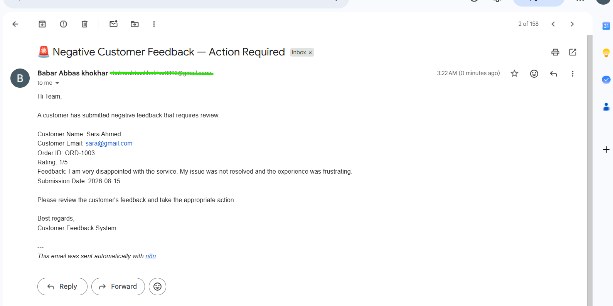
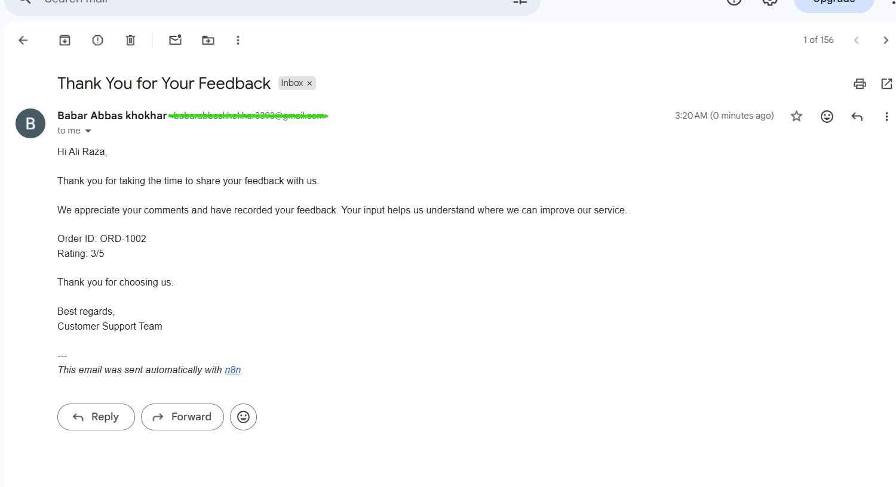
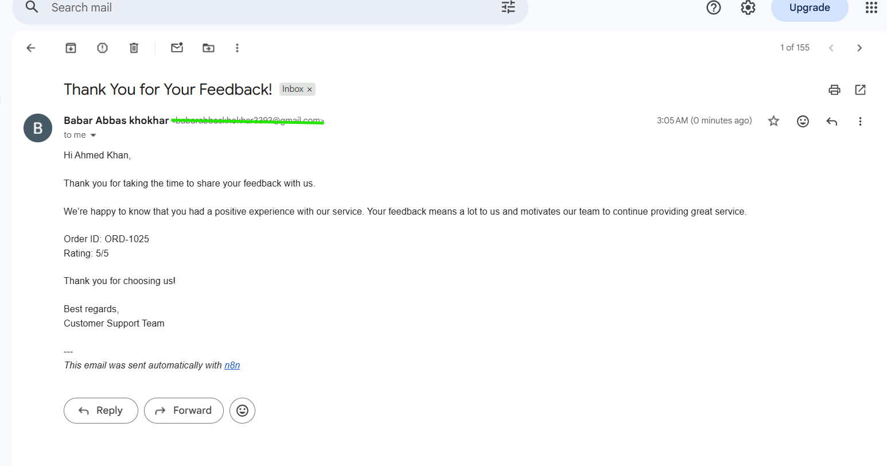

# 📝 Customer Feedback & Complaint Alert System

An n8n-powered customer feedback automation that validates submissions, classifies feedback by rating, stores records in Google Sheets, sends personalized email responses, and escalates negative feedback to the internal team.

---

## 📸 Workflow Screenshots

### 1. Workflow Overview



### 2. Invalid Rating Handling



### 3. Google Sheets Feedback Records



### 4. Negative Feedback Customer Response



### 5. Negative Feedback Team Alert



### 6. Neutral Feedback



### 7. Positive Feedback



---

## ✨ Features

- 📥 Receives customer feedback through a webhook
- ✅ Validates required customer information
- ⭐ Validates customer ratings from 1 to 5
- 📊 Classifies feedback into Positive, Neutral, Negative, or Invalid
- 🗂️ Stores valid feedback in Google Sheets
- 📧 Sends personalized positive feedback emails
- 📧 Sends personalized neutral feedback emails
- 🚨 Sends internal alerts for negative feedback
- 📧 Sends a response to customers who submit negative feedback
- 🔄 Updates negative feedback alert status from `Pending` to `Sent`
- ⚠️ Handles invalid ratings separately
- 🛑 Prevents invalid ratings from entering normal feedback records

---

## 🔄 Workflow Steps

### 1. Receive Customer Feedback

The workflow starts with a webhook that receives customer feedback data.

Expected information includes:

- Customer Name
- Customer Email
- Order ID
- Rating
- Feedback Message
- Submission Date

### 2. Prepare Feedback Data

The incoming webhook data is organized into a consistent structure for further processing.

### 3. Validate Feedback Submission

The workflow checks whether the following required information is available:

- Customer Name
- Customer Email
- Feedback Message

If required information is missing, the submission does not continue through the normal processing flow.

### 4. Determine Sentiment

The customer's rating determines the feedback category:

| Rating | Sentiment |
|---|---|
| 4–5 | Positive |
| 3 | Neutral |
| 1–2 | Negative |
| Outside 1–5 | Invalid |

### 5. Route Feedback by Sentiment

#### Positive Feedback

- Saves the feedback to Google Sheets
- Sets `Alert Status` to `Pending`
- Sends a personalized thank-you email

#### Neutral Feedback

- Saves the feedback to Google Sheets
- Sets `Alert Status` to `Pending`
- Sends a neutral acknowledgment email

#### Negative Feedback

- Saves the feedback to Google Sheets
- Sets `Alert Status` to `Pending`
- Sends an internal team alert
- Updates `Alert Status` to `Sent`
- Sends a response email to the customer

#### Invalid Rating

- Detects ratings outside the 1–5 range
- Sends an email explaining the valid rating range
- Does not save the invalid rating as a normal feedback record

---

## 📊 Google Sheets Structure

Valid feedback is stored with the following fields:

| Field | Description |
|---|---|
| Customer Name | Name of the customer |
| Customer Email | Customer's email address |
| Order ID | Related order identifier |
| Rating | Customer rating |
| Feedback | Customer feedback message |
| Sentiment | Positive / Neutral / Negative |
| Submission Date | Date of feedback submission |
| Alert Status | Pending / Sent |

### Alert Status Logic

- Positive → `Pending`
- Neutral → `Pending`
- Negative → `Pending` initially
- Negative → `Sent` after the internal team alert is successfully sent

---

## 🛠 Technologies Used

- **n8n** — Workflow automation
- **Webhook** — Feedback submission trigger
- **Google Sheets** — Feedback data storage
- **Gmail** — Customer notifications and internal alerts
- **Conditional Logic** — Validation and feedback classification

---

## 📁 Project Structure

```text
customer-feedback-complaint-alert-system/
│
├── README.md
│
└── screenshots/
    ├── 01-workflow-overview.png
    ├── 02-invalid-rating-handling.png
    ├── 03-google-sheets-feedback-records.png
    ├── 04-negative-feedback-customer-response.png
    ├── 05-negative-feedback-team-alert.png
    ├── 06-neutral-feedback.png
    └── 07-positive-feedback.png

 ```
 ## 🚀 Getting Started

### Prerequisites

- An n8n instance
- Google Sheets access
- Gmail account connected to n8n
- A Google Sheet for feedback records
- A system capable of sending POST requests to the n8n webhook

### Setup

1. Import the workflow into your n8n instance.
2. Connect your Google Sheets credentials.
3. Connect your Gmail credentials.
4. Configure the destination Google Sheet.
5. Configure the webhook endpoint.
6. Activate the workflow.
7. Send test feedback submissions.
8. Verify the Google Sheets records and email notifications.

---

## 🧪 Testing Scenarios

### Positive Feedback

**Rating:** `5`

**Sentiment:** `Positive`

**Alert Status:** `Pending`

**Expected Result:**

- Feedback saved to Google Sheets
- Positive customer email sent

### Neutral Feedback

**Rating:** `3`

**Sentiment:** `Neutral`

**Alert Status:** `Pending`

**Expected Result:**

- Feedback saved to Google Sheets
- Neutral customer email sent

### Negative Feedback

**Rating:** `1`

**Sentiment:** `Negative`

**Alert Status:** `Pending → Sent`

**Expected Result:**

- Feedback saved to Google Sheets
- Internal team alert sent
- Alert status updated to `Sent`
- Customer response email sent

### Invalid Rating

**Rating:** `6`

**Sentiment:** `Invalid`

**Expected Result:**

- Invalid rating detected
- Customer informed about the valid rating range
- Invalid rating is not saved as a normal feedback record

---

## 💡 Use Cases

This automation can be used by:

- E-commerce businesses
- Online service providers
- SaaS companies
- Customer support teams
- Agencies
- Subscription businesses
- Small businesses collecting customer feedback

It helps businesses reduce manual feedback processing and ensures negative customer experiences are escalated to the appropriate team.

---

## 🔐 Workflow Source

The complete n8n workflow source is kept private and is available upon request.

The screenshots and documentation demonstrate the workflow's functionality, structure, and test results.

---

## 📌 Project Status

**Completed and Tested ✅**

The workflow successfully handles:

- Customer feedback intake
- Required-field validation
- Rating validation
- Sentiment classification
- Google Sheets storage
- Customer email responses
- Negative feedback escalation
- Alert status tracking
- Invalid rating handling

---

## 👨‍💻 Author

**Babar Abbas Khokhar**
